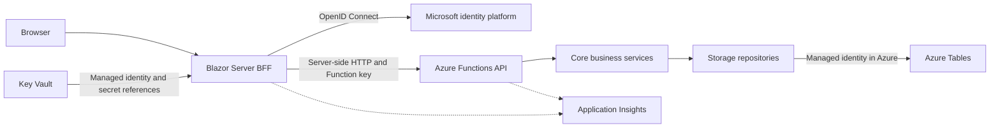

# TalksOps

TalksOps is a .NET 10 application for managing speaking events, session proposals, and an annual calendar. A server-side Blazor application calls an Azure Functions API; Azure Tables stores application data.

## Documentation

- [Source code guide and class diagrams](src/README.md)
- [Infrastructure, architecture, and provisioning guide](infra/README.md)
- [Core domain and business services](src/TalksOps.Core/README.md)
- [REST contracts and HTTP client](src/TalksOps.ApiClient/README.md)
- [Azure Tables persistence](src/TalksOps.Storage/README.md)
- [Functions API](src/TalksOps.Functions/README.md)
- [Blazor Server web application](src/TalksOps.Web/README.md)

## Architecture



## Functions API security and configuration

All HTTP-triggered Functions require a Function key. Keep the key in server-side web configuration or Key Vault; never send it to browser code or publish it as an infrastructure output. Configure the Functions host with `StorageUri` set to the Azure Table service endpoint and `StorageTableName` set to the shared table name. The Function App uses its managed identity through `DefaultAzureCredential` to access Tables. Events and session proposals share that table: events use `events|{ownerId}` partition keys, and session proposals use `sessions|{eventId}` partition keys, where `eventId` is a GUID formatted as 32 hexadecimal digits without hyphens. Row keys remain the event or proposal GUID in the same format.

### Local Functions development

Install Azure Functions Core Tools v4 and Azurite, then start Azurite with its Blob, Queue, and Table services enabled. The Functions project's `local.settings.json` uses these values:

```json
{
	"IsEncrypted": false,
	"Values": {
		"AzureWebJobsStorage": "UseDevelopmentStorage=true",
		"FUNCTIONS_WORKER_RUNTIME": "dotnet-isolated",
		"StorageTableName": "TalksOps",
		"StorageConnectionString": "UseDevelopmentStorage=true"
	}
}
```

From `src/TalksOps.Functions`, run `dotnet run`. When `StorageConnectionString` is configured, the application uses shared-key authentication and creates the application table if it does not exist. Azurite must be running before the Functions start. The standard development connection string uses the Table endpoint at `http://127.0.0.1:10002/devstoreaccount1`; use a custom connection string if your emulator has different endpoints.

`StorageConnectionString` takes precedence over `StorageUri`. Leave it unset in Azure to retain `DefaultAzureCredential` authentication. Do not commit connection strings containing real account keys.

The API receives the user ID in its request envelope or query string. The authenticated Blazor Server application must populate that value from the signed-in principal's `sub` claim, not from editable form data. The Function key is a shared application credential, not per-user authentication: anyone who obtains it can submit a different user ID and potentially act as that user. Stronger caller identity binding requires API token validation or another per-user authentication mechanism.