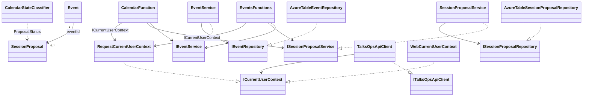

# Source code guide

`src` contains the five .NET 10 projects that implement TalksOps: domain and application services, Azure Tables persistence, an HTTP Functions API, a typed API client, and a server-side Blazor web application.

## Project map

| Project | Responsibility | Detailed documentation |
| --- | --- | --- |
| `TalksOps.Core` | Domain records, validation, service and repository contracts, and owner-scoped application services. | [TalksOps.Core](TalksOps.Core/README.md) |
| `TalksOps.Storage` | Azure Tables implementations of the event and proposal repositories. | [TalksOps.Storage](TalksOps.Storage/README.md) |
| `TalksOps.ApiClient` | REST contracts and the typed HTTP client used by the web application. | [TalksOps.ApiClient](TalksOps.ApiClient/README.md) |
| `TalksOps.Functions` | Function-key-protected HTTP endpoints that call Core services. | [TalksOps.Functions](TalksOps.Functions/README.md) |
| `TalksOps.Web` | Authenticated Blazor Server interface for event, proposal, and calendar workflows. | [TalksOps.Web](TalksOps.Web/README.md) |

## Class diagram

## Cross-project contracts

- `Event` and `SessionProposal` are the domain records. A proposal references its parent event through `EventId`; `ProposalStatus` represents its lifecycle.
- `IEventService` and `ISessionProposalService` expose operations for the current user. Their implementations replace caller-supplied ownership with `ICurrentUserContext.UserId` before persistence.
- `IEventRepository` and `ISessionProposalRepository` separate application behavior from persistence. `TalksOps.Storage` provides their Azure Tables implementations.
- `ITalksOpsApiClient` is the Web-to-Functions boundary. Its DTOs and request records live in `TalksOps.ApiClient.Contracts` and are intentionally separate from Core domain records.
- The Web identity context derives the user ID from the signed-in principal; the Functions request context is initialized per invocation from the API request envelope or query string. A Function key is an application credential and does not independently bind a request to a user.

## Local development

See [TalksOps.Functions](TalksOps.Functions/README.md) for the local API and Azurite setup, and [TalksOps.Web](TalksOps.Web/README.md) for Web authentication and startup. The Web API base address must match the Functions host URL. Infrastructure provisioning and Azure deployment are documented in [infra/README.md](../infra/README.md).
