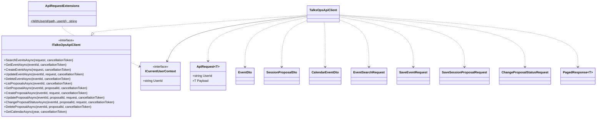

# TalksOps.ApiClient

`TalksOps.ApiClient` defines the JSON request/response contracts shared by the Web and Functions projects and implements a typed `HttpClient` for the TalksOps REST API. It uses `ICurrentUserContext` to include the current user identifier in requests; the Web application supplies that context from the authenticated principal.

## Class diagram

## Types and members

Records below expose positional properties with the listed names and types; records have no additional methods unless specified.

| Type | Properties / purpose |
| --- | --- |
| `ApiRequest<T>` | `UserId: string`, `Payload: T`. Envelope used for POST, PUT, and PATCH requests. |
| `EventDto` | `Id: Guid`, `OwnerId: string`, `Name: string`, `Location: string`, `StartDate: DateOnly`, `EndDate: DateOnly`, `Costs: IReadOnlyDictionary<string, decimal>`. |
| `SessionProposalDto` | `Id: Guid`, `EventId: Guid`, `OwnerId: string`, `Title: string`, `Abstract: string`, `Notes: string`, `Status: ProposalStatus`, `CreatedAt: DateTimeOffset`, `UpdatedAt: DateTimeOffset`. |
| `CalendarEventDto` | `EventId: Guid`, `EventName: string`, `StartDate: DateOnly`, `EndDate: DateOnly`, `ProposalStatuses: IReadOnlyList<string>`. |
| `EventSearchRequest` | `Year: int?`, `Name: string?`, `Location: string?`, `Page: int` (default 1), `PageSize: int` (default 20). |
| `SaveEventRequest` | `Name: string`, `Location: string`, `StartDate: DateOnly`, `EndDate: DateOnly`, `Costs: IReadOnlyDictionary<string, decimal>`; fields accepted to create or update an event. |
| `SaveSessionProposalRequest` | `Title: string`, `Abstract: string`, `Notes: string`; fields accepted to create or update a proposal. |
| `ChangeProposalStatusRequest` | `Status: ProposalStatus`; desired proposal lifecycle state. |
| `PagedResponse<T>` | `Items: IReadOnlyList<T>`, `Page: int`, `PageSize: int`, `TotalCount: int`. |
| `ITalksOpsApiClient` | Typed API contract; all methods accept optional cancellation tokens. |
| `TalksOpsApiClient` | HTTP implementation; requires `HttpClient` and `ICurrentUserContext`. Optional GET methods return `null` on HTTP 404. Other non-success responses throw through `EnsureSuccessStatusCode`; required response bodies must not be empty. |
| `ApiRequestExtensions.WithUserId` | Internal extension that URL-escapes `userId` and appends it using `?` or `&`, depending on the existing path. |

### `ITalksOpsApiClient` methods

| Method | Behavior |
| --- | --- |
| `SearchEventsAsync(request, cancellationToken)` | Searches and returns paged event DTOs. |
| `GetEventAsync(eventId, cancellationToken)` | Gets an event or returns `null` when absent. |
| `CreateEventAsync(request, cancellationToken)` / `UpdateEventAsync(eventId, request, cancellationToken)` | Creates or updates an event. |
| `DeleteEventAsync(eventId, cancellationToken)` | Deletes an event and its proposals. |
| `ListProposalsAsync(eventId, cancellationToken)` / `GetProposalAsync(eventId, proposalId, cancellationToken)` | Lists proposals or gets one, returning `null` when the latter is absent. |
| `CreateProposalAsync(eventId, request, cancellationToken)` / `UpdateProposalAsync(eventId, proposalId, request, cancellationToken)` | Creates or updates a proposal. |
| `ChangeProposalStatusAsync(eventId, proposalId, request, cancellationToken)` | Changes proposal status using PATCH. |
| `DeleteProposalAsync(eventId, proposalId, cancellationToken)` | Deletes a proposal. |
| `GetCalendarAsync(year, cancellationToken)` | Gets calendar summaries for a year. |

The client sends `userId` in the query for GET/DELETE calls and in the request envelope for writes. Keep this client server-side; the Function key and user ID are not browser credentials.
