# TalksOps.Core

`TalksOps.Core` contains TalksOps domain records, business rules, application-service contracts, repository contracts, and owner-scoped event and proposal services. It has no dependency on Azure storage or the Web/Functions hosting layers.

## Class diagram

```mermaid
classDiagram
    class Event {
        +Guid Id
        +string OwnerId
        +string Name
        +string Location
        +DateOnly StartDate
        +DateOnly EndDate
        +IReadOnlyDictionary Costs
    }
    class SessionProposal {
        +Guid Id
        +Guid EventId
        +string OwnerId
        +string Title
        +string Abstract
        +string Notes
        +ProposalStatus Status
        +DateTimeOffset CreatedAt
        +DateTimeOffset UpdatedAt
    }
    class ProposalStatus {
        <<enumeration>>
        Submitted
        Accepted
        Rejected
        Cancelled
    }
    class EventService
    class SessionProposalService
    class ICurrentUserContext {
        <<interface>>
        +string UserId
    }
    class IEventService {
        <<interface>>
        +SearchAsync(criteria, cancellationToken)
        +GetAsync(eventId, cancellationToken)
        +CreateAsync(value, cancellationToken)
        +UpdateAsync(value, cancellationToken)
        +DeleteAsync(eventId, cancellationToken)
    }
    class ISessionProposalService {
        <<interface>>
        +ListByEventAsync(eventId, cancellationToken)
        +GetAsync(eventId, proposalId, cancellationToken)
        +CreateAsync(proposal, cancellationToken)
        +UpdateAsync(proposal, cancellationToken)
        +ChangeStatusAsync(eventId, proposalId, status, cancellationToken)
        +CancelAsync(eventId, proposalId, cancellationToken)
        +DeleteAsync(eventId, proposalId, cancellationToken)
    }
    class IEventRepository {
        <<interface>>
        +SearchAsync(ownerId, criteria, cancellationToken)
        +GetAsync(ownerId, eventId, cancellationToken)
        +CreateAsync(value, cancellationToken)
        +UpdateAsync(value, cancellationToken)
        +DeleteAsync(ownerId, eventId, cancellationToken)
    }
    class ISessionProposalRepository {
        <<interface>>
        +ListByEventAsync(ownerId, eventId, cancellationToken)
        +GetAsync(ownerId, eventId, proposalId, cancellationToken)
        +CreateAsync(proposal, cancellationToken)
        +UpdateAsync(proposal, cancellationToken)
        +DeleteAsync(ownerId, eventId, proposalId, cancellationToken)
    }
    class EventSearchCriteria {
        +int? Year
        +string? Name
        +string? Location
        +int Page
        +int PageSize
    }
    class PagedResult~T~ {
        +IReadOnlyList Items
        +int Page
        +int PageSize
        +int TotalCount
    }
    class EventRules {
        +Validate(value)$ IReadOnlyList~string~
    }
    class SessionProposalRules {
        +Validate(value)$ IReadOnlyList~string~
        +CanTransition(current, target)$ bool
    }

    Event "1" --> "0..*" SessionProposal : EventId
    SessionProposal --> ProposalStatus
    EventService ..|> IEventService
    SessionProposalService ..|> ISessionProposalService
    EventService --> IEventRepository
    SessionProposalService --> ISessionProposalRepository
    EventService --> ICurrentUserContext
    SessionProposalService --> ICurrentUserContext
    EventService ..> EventRules
    SessionProposalService ..> SessionProposalRules
    IEventService ..> EventSearchCriteria
    IEventService ..> PagedResult
```

## Domain types

### `Event`

Immutable record for an event. `Id` is generated by default; `OwnerId`, `Name`, `Location`, `StartDate`, and `EndDate` are required. `Costs` is a name-to-decimal dictionary and defaults to empty. It has no methods.

### `SessionProposal`

Immutable record for a proposal attached to `EventId`. `Id` is generated by default; `OwnerId`, `Title`, and `Abstract` are required. `Notes` defaults to empty, `Status` to `Submitted`, and `CreatedAt`/`UpdatedAt` to the current UTC time. It has no methods.

### `ProposalStatus`

Lifecycle values: `Submitted`, `Accepted`, `Rejected`, and `Cancelled`.

### `EventRules`

`Validate(Event value)` returns validation messages for missing owner/name/location, invalid date range, empty cost names, or negative costs. An empty result means valid input.

### `SessionProposalRules`

`Validate(SessionProposal value)` checks the parent event ID, owner, title, abstract, and timestamp ordering. `CanTransition(current, target)` accepts defined statuses when the target differs from the current value; it does not encode a stricter status-specific transition graph.

## Contracts and services

| Type | Members and behavior |
| --- | --- |
| `ICurrentUserContext` | `UserId` gets the stable ID of the authenticated/current request user. |
| `EventSearchCriteria` | `Year`, `Name`, and `Location` are optional filters; `Page` defaults to 1 and `PageSize` to 20. |
| `PagedResult<T>` | Positional properties: `Items`, `Page`, `PageSize`, `TotalCount`. |
| `IEventRepository` | Owner-scoped `SearchAsync`, `GetAsync`, `UpdateAsync`, and `DeleteAsync`; `CreateAsync` persists a new event. Delete also removes proposals for the event. All methods accept an optional cancellation token. |
| `IEventService` | `SearchAsync`, `GetAsync`, `CreateAsync`, `UpdateAsync`, and `DeleteAsync` for the current user. Create/update validate and overwrite `OwnerId` using `ICurrentUserContext`. |
| `ISessionProposalRepository` | Owner- and event-scoped `ListByEventAsync`, `GetAsync`, `CreateAsync`, `UpdateAsync`, and `DeleteAsync`; methods accept an optional cancellation token. |
| `ISessionProposalService` | `ListByEventAsync`, `GetAsync`, `CreateAsync`, `UpdateAsync`, `ChangeStatusAsync`, `CancelAsync`, and `DeleteAsync` for the current user. Updates preserve server-owned identity and timestamps; status changes update `UpdatedAt`. |
| `EventService` | Implements `IEventService`; constructor dependencies are `IEventRepository` and `ICurrentUserContext`. Validation failures throw `ArgumentException`. |
| `SessionProposalService` | Implements `ISessionProposalService`; constructor dependencies are `ISessionProposalRepository` and `ICurrentUserContext`. Invalid status changes throw `InvalidOperationException`; validation failures throw `ArgumentException`. |

All asynchronous service and repository methods accept an optional `CancellationToken`. Nullable return values from get/update operations indicate that the requested record was not found or is not owned by the caller.
