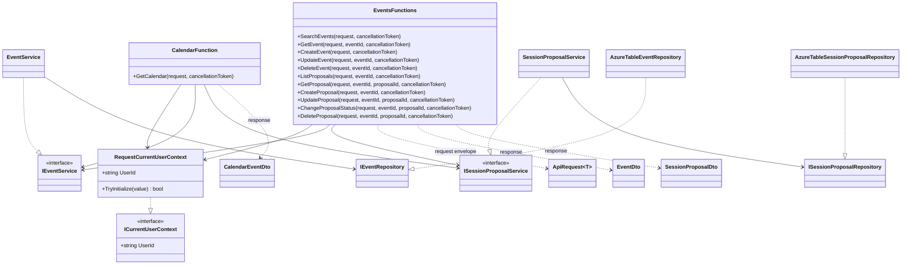

# TalksOps.Functions

`TalksOps.Functions` is the .NET 10 isolated-worker HTTP API. It validates incoming request shapes, initializes a per-invocation user context, delegates business rules to `TalksOps.Core`, and maps domain records to `TalksOps.ApiClient` contracts. HTTP triggers use Function-level authorization.

## Class diagram



## Classes and members

| Type | Members and behavior |
| --- | --- |
| `EventsFunctions` | Constructor injects `IEventService`, `ISessionProposalService`, and `RequestCurrentUserContext`. Public trigger methods: `SearchEvents`, `GetEvent`, `CreateEvent`, `UpdateEvent`, `DeleteEvent`, `ListProposals`, `GetProposal`, `CreateProposal`, `UpdateProposal`, `ChangeProposalStatus`, and `DeleteProposal`. They implement event/proposal search and CRUD plus status changes. Private helpers parse request envelopes and query integers, initialize query/body user IDs, convert request DTOs to domain records and domain records to DTOs, and create 400/409 results. |
| `CalendarFunction` | Injects the event/proposal services and request context. `GetCalendar` validates `userId` and year, pages through all matching events, and returns each event with its proposal status list. |
| `RequestCurrentUserContext` | Scoped implementation of `ICurrentUserContext`. `TryInitialize(string? value)` trims and stores a non-empty value; `UserId` throws `InvalidOperationException` until initialized. It has no public setter property. |
| `Program` (top-level statements) | Configures the isolated Functions worker, Application Insights, scoped Core services and user context, plus Storage registrations. It requires `StorageTableName`; a configured `StorageConnectionString` takes precedence over `StorageUri`. With a connection string, it creates the table if absent. |

There are no additional public data properties on the endpoint classes. Request/response records, including `ApiRequest<T>`, `EventDto`, `SessionProposalDto`, and `CalendarEventDto`, are documented in [TalksOps.ApiClient](../TalksOps.ApiClient/README.md).

## HTTP endpoints

The default Functions route prefix is `/api`. Every trigger below requires Function-level authorization and therefore a Function key when the host enforces keys.

| Method and route | Purpose |
| --- | --- |
| `GET /api/events` | Search by optional `year`, `name`, `location`, `page`, and `pageSize`; returns `PagedResponse<EventDto>`. |
| `GET /api/events/{eventId}` | Get an event; returns 404 if absent. |
| `POST /api/events` | Create an event from an `ApiRequest<SaveEventRequest>` envelope. |
| `PUT /api/events/{eventId}` | Update an event. |
| `DELETE /api/events/{eventId}` | Delete an event and its proposals. |
| `GET /api/events/{eventId}/proposals` | List proposals for an owned event. |
| `GET /api/events/{eventId}/proposals/{proposalId}` | Get a proposal. |
| `POST /api/events/{eventId}/proposals` | Create a proposal from an `ApiRequest<SaveSessionProposalRequest>` envelope. |
| `PUT /api/events/{eventId}/proposals/{proposalId}` | Update proposal fields. |
| `PATCH /api/events/{eventId}/proposals/{proposalId}/status` | Change lifecycle status from an `ApiRequest<ChangeProposalStatusRequest>` envelope. |
| `DELETE /api/events/{eventId}/proposals/{proposalId}` | Delete a proposal. |
| `GET /api/calendar?year={year}` | Return calendar events and their proposal statuses for the year. |

GET/DELETE operations take `userId` in the query string; write operations take it in the `ApiRequest<T>` body. The Web application derives this value from the authenticated principal. A Function key is a shared application credential, not user authentication: do not expose it or allow untrusted clients to choose another user's ID.

## Local configuration and run

Prerequisites: .NET 10 SDK, Azure Functions Core Tools v4, and Azurite with Blob, Queue, and Table endpoints enabled. The checked-in `local.settings.json` uses the standard local emulator values:

```json
{
  "IsEncrypted": false,
  "Values": {
    "AzureWebJobsStorage": "UseDevelopmentStorage=true",
    "FUNCTIONS_WORKER_RUNTIME": "dotnet-isolated",
    "StorageTableName": "TalksOps",
    "StorageConnectionString": "UseDevelopmentStorage=true"
  }
}
```

Start Azurite in one terminal, then run the Functions host from this project directory:

```powershell
azurite
func start --port 7071
```

Azurite's standard Table endpoint is `http://127.0.0.1:10002/devstoreaccount1`. With a local connection string, the application creates the `TalksOps` table on startup. The Web project's development API base address defaults to `http://localhost:7071/`; use the same port or update `TalksOpsApi:BaseAddress`. If your local host uses Function keys, configure the matching key in Web user secrets as `TalksOpsApi:FunctionKey`; leave it empty if the local host accepts requests without a key.

`StorageConnectionString` takes precedence over `StorageUri`. For Azure, leave the connection string unset and configure `StorageUri` with the Table service endpoint so `DefaultAzureCredential` is used. Do not put real account keys in source control. See the root [README](../../README.md) and [infrastructure guide](../../infra/README.md) for security boundaries and Azure configuration.
