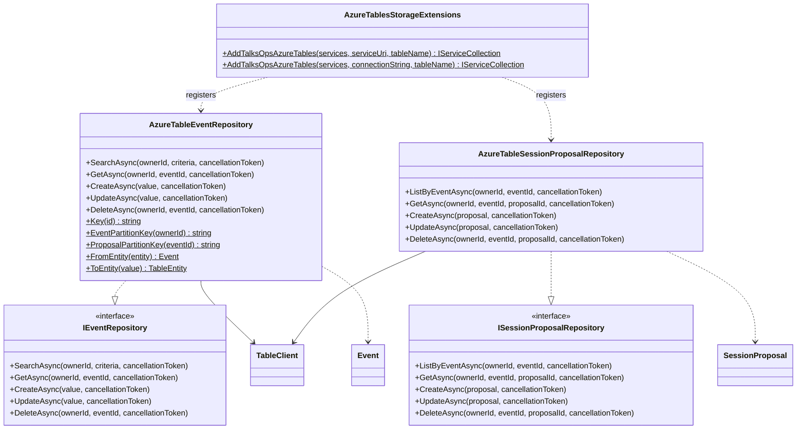

# TalksOps.Storage

`TalksOps.Storage` implements Core repository contracts with Azure Table Storage. Events and session proposals use one configured table and distinct partition-key prefixes; the repositories enforce owner/event scoping when reading and mutating records.

## Class diagram

## Classes and methods

| Type | Members and behavior |
| --- | --- |
| `AzureTableEventRepository` | Constructor takes a `TableClient`. Implements `SearchAsync`, `GetAsync`, `CreateAsync`, `UpdateAsync`, and `DeleteAsync` from `IEventRepository`. Search filters by owner, optional year/name/location, sorts by date/name/ID, and clamps page size to 1–100. Delete removes proposals and then the event. |
| `AzureTableSessionProposalRepository` | Constructor takes a `TableClient`. Implements `ListByEventAsync`, `GetAsync`, `CreateAsync`, `UpdateAsync`, and `DeleteAsync` from `ISessionProposalRepository`. It verifies that the owner owns the parent event and filters proposals by owner. |
| `AzureTablesStorageExtensions` | `AddTalksOpsAzureTables(IServiceCollection, Uri, string)` configures `DefaultAzureCredential`; `AddTalksOpsAzureTables(IServiceCollection, string, string)` configures a connection string (including Azurite). Both register a shared `TableServiceClient`, `TableClient`, and singleton repository implementations. |

`AzureTableEventRepository` also provides internal conversion/key helpers: `Key(Guid)` formats IDs using the GUID `N` format; `EventPartitionKey(ownerId)` returns `events|{ownerId}`; `ProposalPartitionKey(eventId)` returns `sessions|{eventId:N}`; `FromEntity` and `ToEntity` map event records to/from table entities. Proposal entity mapping and parent ownership checks are private to `AzureTableSessionProposalRepository`.

## Table layout

Events and proposals share the `TalksOps` table by default. Event rows use partition key `events|{ownerId}` and event GUID row keys. Proposal rows use partition key `sessions|{eventId:N}` and proposal GUID row keys; each row also stores `OwnerId`. GUIDs use 32 hexadecimal characters without hyphens. See [infra/README.md](../../infra/README.md#application-data-partitions) for migration implications when changing partition prefixes.

Authentication is selected by the registration overload: Azure uses `DefaultAzureCredential` with the table service URI; local development uses the Azurite connection string. The Functions host chooses `StorageConnectionString` when set, otherwise `StorageUri`.
