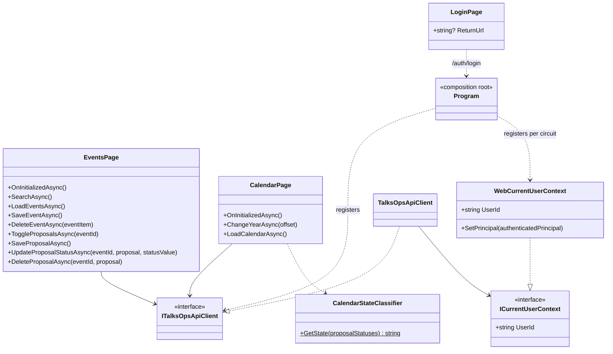

# TalksOps.Web

`TalksOps.Web` is the authenticated server-side Blazor application and backend-for-frontend. It presents event and proposal management plus an annual calendar, calls the Functions API through `ITalksOpsApiClient`, and derives the caller ID from the authenticated principal. The Function key stays in server-side configuration.

## Class diagram



## Components and members

Razor component code-behind members are private unless explicitly identified as a component parameter/property.

| Component/type | Properties and methods |
| --- | --- |
| `Events.razor` (`/events`) | Injects `ITalksOpsApiClient Api` and `IJSRuntime JavaScript`. State fields hold event results, search filters, loading/editor state, proposal cache, and success/error messages. `OnInitializedAsync` loads events; `SearchAsync` and `LoadEventsAsync` refresh the list; `BeginCreateEvent`/`BeginEditEvent` initialize the event editor; `SaveEventAsync` validates and saves; `DeleteEventAsync` confirms then deletes. `ToggleProposalsAsync` expands/collapses an event and loads its proposals; `BeginCreateProposal`/`BeginEditProposal`, `SaveProposalAsync`, `UpdateProposalStatusAsync`, and `DeleteProposalAsync` manage proposals. `CloseEventEditor` and `CloseProposalEditor` reset editor state. `NullIfEmpty`, `FormatCosts`, and `ParseCosts` normalize filters and display/parse newline-separated `name=amount` costs. |
| `Calendar.razor` (`/calendar`) | Injects `ITalksOpsApiClient Api`. State fields: `Year`, `Events`, `IsLoading`, `ErrorMessage`. `OnInitializedAsync` loads the current year; `ChangeYearAsync(offset)` changes year within 1–9999 and reloads; `LoadCalendarAsync` fetches and records errors. |
| `CalendarStateClassifier` | Static `GetState(IReadOnlyCollection<string> proposalStatuses)` returns `accepted`, `submitted`, `rejected`, `cancelled`, or `none`, in that precedence order. |
| `WebCurrentUserContext` | Scoped implementation of `ICurrentUserContext`. `SetPrincipal(ClaimsPrincipal)` assigns the current Blazor circuit principal. Read-only `UserId` resolves the `sub` claim first, then `NameIdentifier`, and throws if unavailable. |
| `Login.razor` (`/login`) | Public nullable `ReturnUrl` property is bound from the query. Private `ReturnUrlValue` defaults an empty return URL to `/events`; the page is anonymous and starts `/auth/login`. |
| `Home.razor` (`/`) | Authenticated route; `OnInitialized` redirects to `/events`. |

The shared layout, router, error/not-found pages, and static assets are under `Components`. `Counter.razor` and `Weather.razor` are template/demo pages and are not part of the primary TalksOps workflows.

## Local configuration and run

Prerequisites: .NET 10 SDK and a running Functions API plus Azurite. `appsettings.Development.json` enables the local fake account by default (`Authentication:UseFakeAccount=true`); it issues a development cookie with a configurable fake ID/name and does not require Microsoft sign-in.

Relevant settings (JSON or environment/user-secrets configuration):

| Setting | Purpose |
| --- | --- |
| `TalksOpsApi:BaseAddress` | Functions host base URL; defaults to `http://localhost:7071/`. |
| `TalksOpsApi:FunctionKey` | Optional server-side Function key sent as `x-functions-key`; configure only when the local host requires it. |
| `Authentication:UseFakeAccount` | Development-only switch for local cookie sign-in. It is honored only in the Development environment. |
| `Authentication:FakeAccountId` / `Authentication:FakeAccountName` | Optional identity values for the local fake account. |
| `AzureAd:Instance`, `AzureAd:TenantId`, `AzureAd:ClientId`, `AzureAd:CallbackPath` | OpenID Connect configuration when fake account mode is disabled. Keep client secrets in user secrets or another secret store. |

Run the Functions API first on port 7071 as described in [TalksOps.Functions](../TalksOps.Functions/README.md). Then run the Web project:

```powershell
dotnet run --launch-profile http
```

Open `http://localhost:5211`. To use different API ports, set `TalksOpsApi:BaseAddress` (for example through `dotnet user-secrets set "TalksOpsApi:BaseAddress" "http://localhost:7147/"`). Never place a production Function key or identity secret in `appsettings*.json` or browser-visible configuration.
